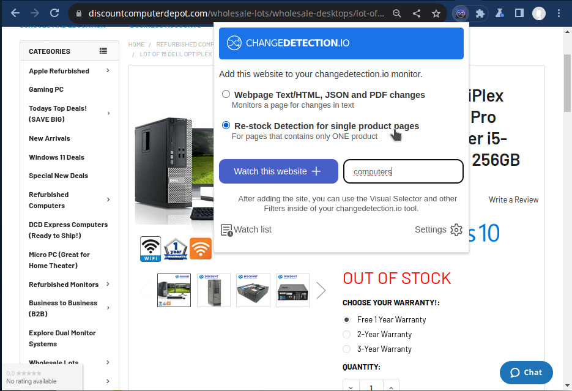

# Web monitor browser extension for changedetection.io 

Easily add-to and manage your list of monitored websites directly in your browser.

<picture>
  
</picture>

  

  <!-- JavaScript Badge -->
  

[//]: # ()
[//]: # (  <a href="https://chrome.google.com/webstore/detail/changedetection.io-browser-extension/ogjibjphoadhljaoicdnjnmgokohngcc" target="_blank">)

[//]: # (    )

[//]: # (  </a>)

[//]: # ()
[//]: # (  <a href="https://addons.mozilla.org/en-US/firefox/addon/openai-translator/" target="_blank">)

[//]: # (    )

[//]: # (  </a>)

This extension provides the missing link between your browser and your <a href="https://github.com/dgtlmoon/changedetection.io">changedetection.io installation/account</a>, simply
click <strong>"Watch this website"</strong> to add the current webpage to your list of monitored pages.

# Installation

**Step One** - Install via ~~WebShop~~ ( We are waiting for the developer store to authorise our account ) or Local install

**Step Two** - Simply access your changedetection.io account/installation, then visit the <strong>"Settings"</strong> page and click on the <strong>"API &amp; Plugins"</strong> tab and I will automatically configure myself.

## From WebStore

We are waiting for the developer store to authorise our account :-( sad :-(

## From source code (Google Chrome)
1. Download and unzip this repository.
2. Open Extensions(chrome://extensions/).
3. Enable "Developer mode".
4. Click on "Load Unpacked" and open the directory `changedetection.io-browser-plugin/src`.
